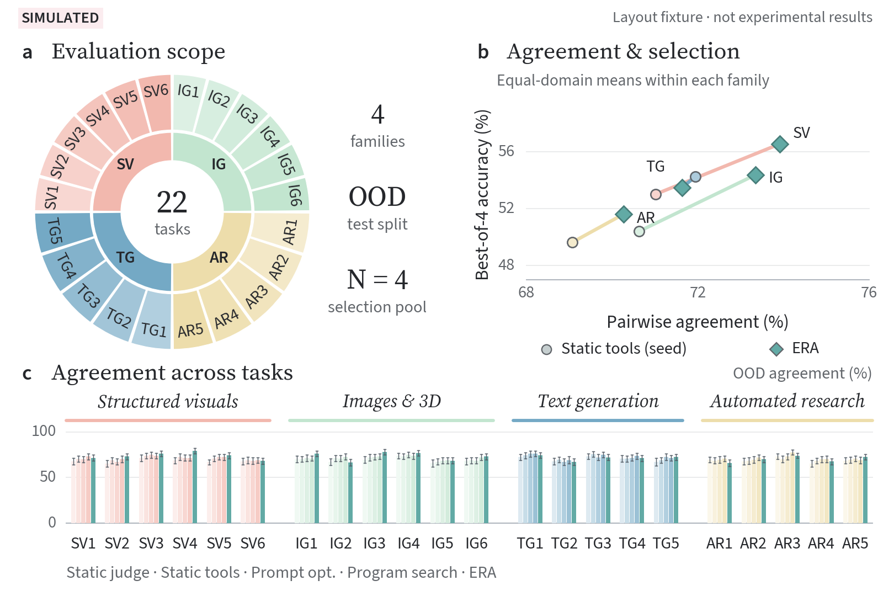

# 人类反馈驱动的评价系统进化：论文草稿

**Evolving Evaluation Systems from Human Feedback for Open-Ended Tasks**

本仓库撰写面向开放任务的人类反馈驱动评价系统进化论文，目前不使用项目缩写。研究范围涵盖结构化视觉产物、图像与 3D、文本生成和自动科研，不限定为 slide generation。ERA 仅指证据引导评估器演化方法，不是项目名称，也不另造缩写全称；历史来源与计划文件名保持原样。

论文依照源码项目的 `docs/plans/p2e_v2_plan.md` 及其最新 §3.2 补丁，以“给定任务及其人类反馈，能否进化出更符合该任务评价标准的 evaluator”为主线。复用已有偏好与新收集偏好是两种数据构建设置，共用算法；同一领域可以兼有两者。现成 H0 决定需要补哪些数据工作，不决定算法或领域定义。标签来源、协议、一致性、弃权和结果分别报告，新标注不被预设为更可靠。新建数据集与证明分歧采样有效是不同结论，后者需要等预算随机采样对照。

当前使用原版 ICLR 2027 模板、匿名审稿模式。按作者要求加入了**明确标记的模拟数据图表**，供审阅报告设计、配色和排版；没有实证结果，模板的 “Under review” 页眉不表示已经投稿。源码仓库 [Auto-Evolve-Harness-for-Slide-Evaluation](https://github.com/Moore-Tian/Auto-Evolve-Harness-for-Slide-Evaluation) 保留历史名称，本轮没有修改、重命名该代码仓库或启动实验。

## 阅读

- [paper.pdf](paper.pdf)：编译预览，正文 9 页。
- [main.tex](main.tex)：主入口，Overleaf 选择此文件。
- [sections/](sections/)：正文和附录，新增独立的偏好挖掘章节。
- [figures/](figures/)：11 张图，2 张正文图、9 张附录图；其中 2 张概念图、1 张预算对比占位图、8 张模拟定量图。
- [data/simulated/](data/simulated/)：14 个全量模拟 CSV，`landscape/` 中原组图的均衡子集，以及 `c1_landscape/` 中正文新图的全量队列汇总和几何导出，不含真实标注或实验结果。
- [可视化参考与设计说明](.paper/visual_references.md)：指定的 post-training survey（2503.06072）、full-stack safety survey、Speculative RAG、MMMR 图例，以及本项目采用的具体表达方式。
- [三张参考图对应的配色候选](.paper/palette_candidates.md)：直接采用原图标注色值的浅蓝—玫瑰粉、蓝—橙、青蓝—杏橙方案；不混入新的色系。
- [完整覆盖映射](.paper/plan_coverage.md)：计划条目与正文、图表、证据边界的对应。
- [主张索引](.paper/claims.yml)、[图表索引](.paper/figures.yml)：后续写作与图文一致性校验的结构化记忆。
- [references.bib](references.bib)：40 条引文，含作者指定的四篇 2026 年论文；来源见 [reference_sources.json](.paper/reference_sources.json)，出版处核验、全文支持范围及未决项见 [citation_audit.md](.paper/citation_audit.md)。

正文保留 Figure 1 总览、Figure 2 横版 C1 组图，以及 Table 1 对齐与选择主表。新版 Figure 2 位于第 8 页，沿用任务环、右上散点、下方四族柱图、Source 字体和湖绿色 ERA；右上改为偏好一致性与 Best-of-4 选择的关系，下方覆盖全部 22 个任务。主表按 ID/OOD 分列，完整比较指标、judge、校准、微调、prompt 优化、程序搜索和 ERA，单元格仍待测。正文保持 9 页，结果解释仍为条件式。

新图由现有模拟记录重新汇总，未生成新的观测，也未修改原始数据。柱图使用每个任务上五个方法共同完成的全量 OOD 输入；选择准确率保留全部请求输入，将评分失败计为选择失败。原来的 2,880 输入均衡子集组图完整保留为附录 Figure 5。空白预算图移为附录 Figure 4，下游 C2/C3 待测表移为附录 Table 8，正文分析仍保留。全稿共 12 张图、15 张表、36 页；不含实测结果或模拟 C3 训练。



[正文组图 PDF](figures/simulated/c1_landscape.pdf) · [正文组图 SVG](figures/simulated/c1_landscape.svg) · [数据与复核说明](data/simulated/c1_landscape/README.md) · [保留的原图](figures/simulated/landscape_outcomes.pdf)

C1 模拟数据现覆盖全部 22 个领域，每个构建设置 11 个；保留原有 8 个领域的数据和区间，新增 14 个领域的布局数据，并重算 C1 汇总、排名和成本。标注、组件和 C2 仍使用明确标注的 8 个诊断领域，不再代替全域覆盖。R/N 是复用／新收偏好的示意分配，不代表真实标签可用性、固定领域类别或完成了 22 个实验；同一领域实际可以兼有两种数据来源。

论证主线遵循计划 §§1–2.3：开放任务中的质量判断依赖语境和多维取舍，现有指标与 judges 仍可能偏离人类偏好。偏好给出判断结果，却没有完整指定判断新产物所需的标准与证据。我们研究利用偏好数据推动评价 agent 自进化，使反馈能够用于改变可执行的评价过程。人类标准是目标，进化的是程序对该标准的显式近似；误判原因定位是支撑机制，而不是论文的首要问题。摘要依次交代对齐困难、偏好到评价过程的转化缺口、反馈驱动的进化方法及跨任务验证目标；参数适配对照和数据来源协议放在正文论证。ERA 以机制假设为探索单位、完整程序为选择单位。这些方法定义不构成绩效证据。

“为什么不只调参”通过明确的对照回答：校准已有分数的权重／阈值、固定结构的评价器权重微调，以及固定 base model 的程序进化。附录 Table 7 和共享观察对照区分改变证据与改变解释方式，核算相同监督下的适配、选择和部署成本。不声称微调不能学习标准或工具使用，也不预设进化更省数据或更有效。显式规则和轨迹可供检查，不等于已经证明解释忠实。这些评价器对照不同于 C3 的生成器训练，本轮没有执行或模拟微调结果。

C1 检验固定候选池上的对齐与选择；C2 从共享的新生成输出出发比较 critic，两种构建设置都需要对新输出另收盲化人类判断；C3 设计冻结 reward 下的 LoRA + GRPO 对照。C3 仅为研究设计，没有执行训练，也没有生成模拟训练结果。正文中的下游待测表与附录模拟图表分开，横线表示未测量，不是零值。

Method 参考 SkillOpt 的“对象—目标—更新—选择”行文，增加偏好一致性目标、测量估计、候选接受条件以及 best/working 的独立更新公式。公式仅表达已有实现与开发分数的选择不变量，不声称泛化或收敛保证，也不将诊断续搜写成自动语义证伪器。Fig1 沿用现有配色和布局，并明确现成数据集挖掘与新偏好收集两条路径。

## 编译和检查

需要 TeX Live 或同等环境，含 pdfLaTeX、BibTeX、TikZ、algorithm/algpseudocode、booktabs/tabularx/longtable、multirow、placeins 和 natbib。离线检查使用 Python 3、NumPy 及 Poppler 的 `pdfinfo`、`pdftotext`；NumPy 用于独立复算新组图的 bootstrap 区间。

```bash
make
make check
```

重新生成模拟数据、矢量图和数值表（需要 NumPy、Matplotlib 和 TeX Gyre Heros 字体）：

```bash
make simulated
# 或使用隔离环境（重新生成后检查图表与清单）：
uv run --python 3.11 --with numpy==1.24.4 --with matplotlib==3.7.5 python scripts/render_simulated_results.py
make check
```

生成器固定种子为 `20260916`，不调用模型、不执行 ERA、不读取 benchmark 结果。数值、区间和成本仅用于布局示例，不能用于预测效果、功效分析或方法排名。本轮生成环境为 Python 3.8.10、NumPy 1.24.4、Matplotlib 3.7.5、fontTools 4.57.0；相同环境可确定性再生成。隔离环境中的字体处理依赖也可能改变 PDF 字节，因此跨环境再生成后需重新审阅版面和清单。

`python3 scripts/render_c1_landscape.py` 可单独重建正文 Figure 2，`scripts/check_c1_landscape.py` 检查其全量队列、区间和选择分母。普通编译直接使用已保存的矢量图。

`make simulated` 重建全量模拟图表，保留旧 atlas 作为归档，不覆盖附录的横版组图。新图的 PDF/SVG 是已冻结的绘图产物，普通编译不依赖本地预览目录或绘图字体；`scripts/check_landscape_results.py` 独立验证其固定哈希抽样、数值、区间和导出坐标。若改变全量模拟数据，需要重新生成并审阅横版图，不能仅改哈希使检查通过。

逐图视觉检查（额外需要 Pillow、`standalone.cls` 和 `pdftoppm`）：

```bash
make figures
# 或在独立环境中运行，不改项目依赖：
uv run --python 3.11 --with pillow python scripts/render_figures.py
```

生成 `build/figure-review/` 下的独立矢量 PDF、PNG 与 `contact-sheet.png`；
可向脚本传入 `overview`、`evaluator` 等图名，只重绘指定图。预览渲染不调用模型 API。

按三张作者参考图，对同一组图生成配色候选：

```bash
make palettes
```

输出位于 `build/reference-palettes/`：`reference-comparison.png` 为全域图与诊断图的三方案对照，
`overview-comparison.png` 为主流程图对照，`reference-sources.png` 展示本地参考图与原始色值。
各候选目录中包含 `main-figures.png`、两页原生矢量 `main-figures.pdf`（正文全域图＋附录诊断图）、`overview.pdf`
和灰度预览。`review.json` 记录原图哈希、色值映射、文字对比度与数据一致性检查。
候选使用隔离目录，不覆盖正式图表；14 份 CSV 与数值表须与当前正式数据逐字节一致，并核对 110 个全域图数值和 22 个配对区间。
除正文 Figure 2 和附录 Figure 5 横版组图外，其余图表暂用 A（第一张参考的浅蓝—玫瑰粉）；该组图使用各任务族浅色基线与统一湖绿强调，不再采用五种等权方法色。
上一轮被否定的四套方案只留在旧的 `build/palette-review/` 本地归档中。

构建中间文件位于 `build/`，最终文件为 `paper.pdf`。已提交的矢量图可直接编译，不要求本地重新生成模拟数据，也不需要 Azure 登录或模型 API。Overleaf 上传 TeX、BibTeX、模板、`figures/`、`output/imagegen/` 即可。`.paper/*.yml` 使用 JSON 兼容的 YAML，便于标准库检查，仍可由 YAML 工具读取。

`make check` 检查引用、标签、9 页限制、溢出、图像哈希与排印分辨率、22 领域、主张状态、图表标题和正文引用，以及模拟数据的配对、缺失分母、数值表、一致性、弃权和成本汇总。结构与算术检查不代替学术审读或实证验证。

`python3 scripts/check_simulated_results.py --submission` 是投稿保护检查：当前应以状态码 2 拒绝通过，因为仍有模拟图表。只有替换为获准的真实测量、重算区间并重新审计主张，才能形成含实证结果的投稿稿；不能仅删除模拟标记。

## 配色、字体与图表

本节记录其余图表的参考色方案。正文 Figure 2 与附录 Figure 5 保留横版布局，配色与 Source Sans 3 / Source Serif 4 字体以该图说明为准。

本轮按三张参考图分别建立候选，在相同数据、尺度、字体和布局下比较。正文暂用 A，将五色完整用于五种方法：静态 judge 浅蓝 `#74A9C5`、静态工具种子薄荷 `#C2E5CF`、prompt 优化奶油黄 `#EDDDAB`、程序搜索浅桃 `#F2B8AE`、ERA 玫瑰粉 `#DD7389`；两种纯指标参照用灰色。B 采用第二张图的蓝—橙序列，C 采用第三张图的青蓝—杏橙序列，也均使用完整的五色组合。色值来自图片中明确标注的 HEX，不靠 JPEG 像素估色，不额外混入紫色或铜色。原图只出现在本地来源对照页，不进入论文或自动提交，也不使用其数值和显著性标记。

图面以白底和深灰文字为基础，保留参考图原来的浅色块；通过深色数值保证可读性，不再为白字把蓝色加深。密度填充采用 88% 基色与白色混合，组件热图采用完整五色，奶油色对应零点，范围固定为 ±6。五种采样策略使用等宽彩色线条，各有独立的分位区间。深色衍生色只用于细线、散点和图内少量彩色文字。

八张定量图按问题采用不同形式，全部保留在模拟附录，正文优先展示主表与预算对比。弃权单列且保留原分母；成本面板的连线只表示同一方法的两个数据设置。分裂小提琴图用四种颜色标识四级反馈，左半为复用偏好、右半为新收偏好，右半补充稀疏纹理；ID/OOD 使用并列面板。每套方案检查 29 组小字与底色的对比度，并提供灰度预览；不靠颜色单独传达信息，也不将这些参考色系称为已认证的色盲安全方案。配色候选之间的数据不变；全域扩展则保留旧记录并加入 14 个 C1 领域，不声称本轮全部数据均未变化。

正文保留 ICLR 的 Times 字体和正式标题层级；原生 TikZ 图局部使用 Helvetica 兼容字体，定量图使用 TeX Gyre Heros。图标题约 8.5 pt、轴标题 8 pt、刻度和图例约 7.3–7.5 pt，按 5.4 英寸原生宽度输出并检查文字边界。表格采用三线表、对齐的数值列和轻量行底色。实际 PDF 页面的图注、段落断页、图例留白和图标碰撞也纳入检查，没有修改官方模板的字号、边距或版芯。

GPT Image 2 的已验证调用路线是指定 Azure Foundry 资源的 `/openai/v1/`，不是不可用。现有[原图](output/imagegen/edit-source.png) → [加红杯、保留蓝碗](output/imagegen/edit-preserved.png) → [误删蓝碗](output/imagegen/edit-omission.png) 的素材链和提示、哈希完整保留。目前只有图 1 使用保留蓝碗的照片，宽 1.96 cm，约 1990 DPI；其余照片和旧概念图已退出正文。本轮图表由原生矢量绘图生成，没有新增模型调用。[image_generation.md](.paper/image_generation.md) 记录素材来源，用户指定的 API 使用文档在前轮已经更新。

已有数值显示保留逐图、逐表、逐行的模拟披露；新表格和预算图注明尚未测量。配对效应使用共同完成的输入；数值表使用各方法完成的输入；排名构成保留未评分输入，避免分母混用。新建数据、采样有效性和组件有效性仍需不同实验证据。主张 C27/C28 保持待验证，不因模拟图表升级为结果。写作不收录调试流水账或历史中间方法。

## 后续作者工作

冻结实际实验域、数据、标注协议、模型、对照和预算；提供经授权的结果与新生成输出的盲化判断；完成作者信息、许可、伦理和 AI 使用声明。不得用 H0 推导出并不存在的 H1/H2，不能把模型解释写成人类理由。

本公开仓库含可识别的项目来源，不是匿名补充材料。投稿前需独立检查 PDF、代码链接、补充材料与元数据的匿名性。不得提交凭据、私有运行路径、真实样本标识、日志、生成评估器或未经授权的结果。

## 模板来源

`iclr2027_conference.sty` 与 `iclr2027_conference.bst` 原样取自
[ICLR/Master-Template](https://github.com/ICLR/Master-Template/tree/46ed6f4c6cef5b175dde23639e77d44c3463b230/iclr2027)，提交 `46ed6f4c6cef5b175dde23639e77d44c3463b230`。
未修改字体、页边距或版芯。初投稿正文上限为 9 页，参考文献、附录及规定声明不计入；提交前再次核对当年官方政策。
